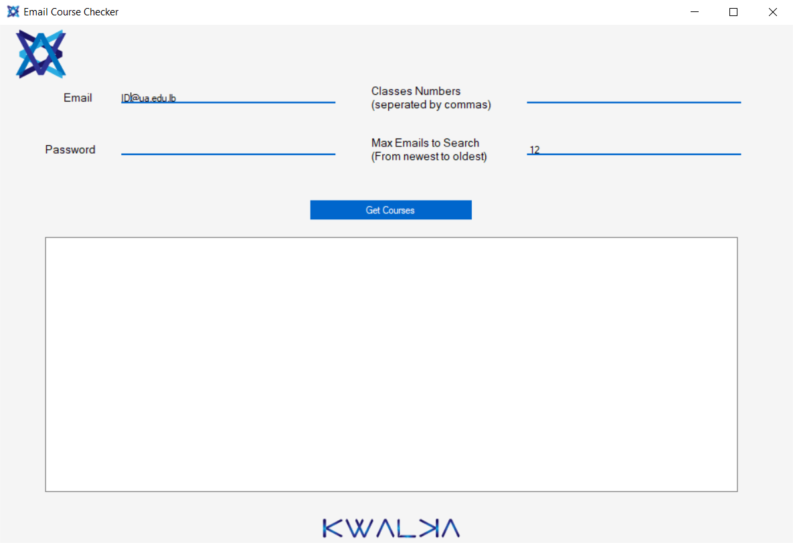
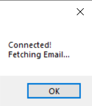

# EmailCourseChecker
When you open the application you will get this view.

Add your UA credentials, courses number and make sure to have a maxEmails value higher than the number of emails you received after the online courses email.

If your credentials are correct you will get this message, wait for approx 10 seconds and your courses will appear.

